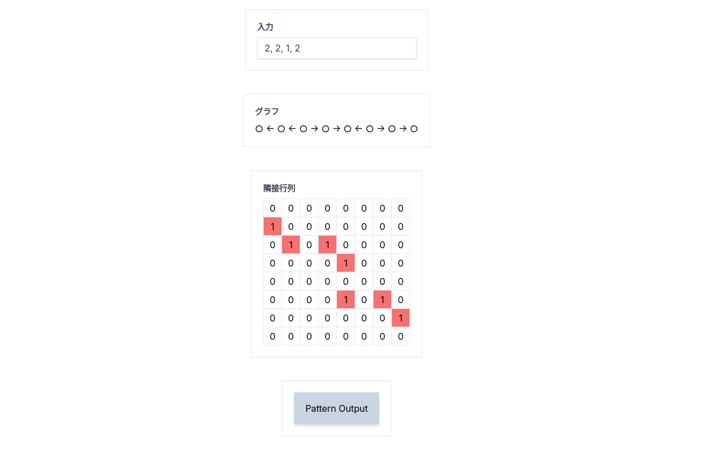

# cofraq

有理数連分数展開で出た数字をなんか An 型のグラフで表してその数を数えるやつ

先生が作ってほしい言ったので作る

サイト

[https://sheerlore.github.io/cofraq/](https://sheerlore.github.io/cofraq/)

## 例

1. 有理数？の連分数展開する

$$
  \dfrac{11}{3} = 3 + \dfrac{1}{1 + \dfrac{1}{1 + \dfrac{1}{1}}}
$$

$$
\longrightarrow  (3, 1, 1, 1)
$$

2. この数字の両端を-1する

$$\rightarrow  (2, 1, 1, 0)$$

3. この数字に対して（左、右、左、右、...　）の順番で数字の数だけ向き付け矢印を書く。このときの頂点は適当に取る

$$
\text{○} \leftarrow \text{○} \leftarrow \text{○} \rightarrow \text{○} \leftarrow \text{○}
$$

4. 次のルールで黒く塗りつぶしていく。黒く塗る個数ごとに何パターンあるか数える

$$\text{ルール：} \text{●} \rightarrow \text{○} \text{ の部分がない} $$

- 0 個

$$\text{○} \leftarrow \text{○} \leftarrow \text{○} \rightarrow \text{○} \leftarrow \text{○}$$

- 1 個

$$\text{●} \leftarrow \text{○} \leftarrow \text{○} \rightarrow \text{○} \leftarrow \text{○}$$

$$\text{○} \leftarrow \text{○} \leftarrow \text{○} \rightarrow \text{●} \leftarrow \text{○}$$

- 2 個

$$\text{●} \leftarrow \text{●} \leftarrow \text{○} \rightarrow \text{○} \leftarrow \text{○}$$

$$\text{○} \leftarrow \text{○} \leftarrow \text{○} \rightarrow \text{●} \leftarrow \text{●}$$

$$\text{●} \leftarrow \text{○} \leftarrow \text{○} \rightarrow \text{●} \leftarrow \text{○}$$

- 3 個

$$\text{●} \leftarrow \text{●} \leftarrow \text{○} \rightarrow \text{●} \leftarrow \text{○}$$

$$\text{●} \leftarrow \text{○} \leftarrow \text{○} \rightarrow \text{●} \leftarrow \text{●}$$

- 4 個

$$\text{●} \leftarrow \text{●} \leftarrow \text{○} \rightarrow \text{●} \leftarrow \text{●}$$

$$\text{●} \leftarrow \text{●} \leftarrow \text{●} \rightarrow \text{●} \leftarrow \text{○}$$

- 5 個

$$\text{●} \leftarrow \text{●} \leftarrow \text{●} \rightarrow \text{●} \leftarrow \text{●}$$

0 個から順にパターン数は　（1, 2, 3, 2, 2, 1）
これを整数係数多項式の係数にする。つまり。

$$
1 + 2X + 3X^2 + 2X^3 + 2X^4 + X^5
$$

これが7次以上で既約（因数分解できない）だそう。

ここでは、明らかにモニック（最高次係数が１）なので、
次の定理から、$\mathbb{Q}$ 上既約かどうかを調べて $\mathbb{Z} $ 上既約か判定できそう？

定理

$f(x) \in \mathbb{Z}[x] $をモニックかつ $deg f \ge 1 $ とする。このとき次は同値である。

(1) $f(x)$ は　$\mathbb{Z} $上 既約である。

(2) $f(x)$ は　$\mathbb{Q} $上 既約である。
